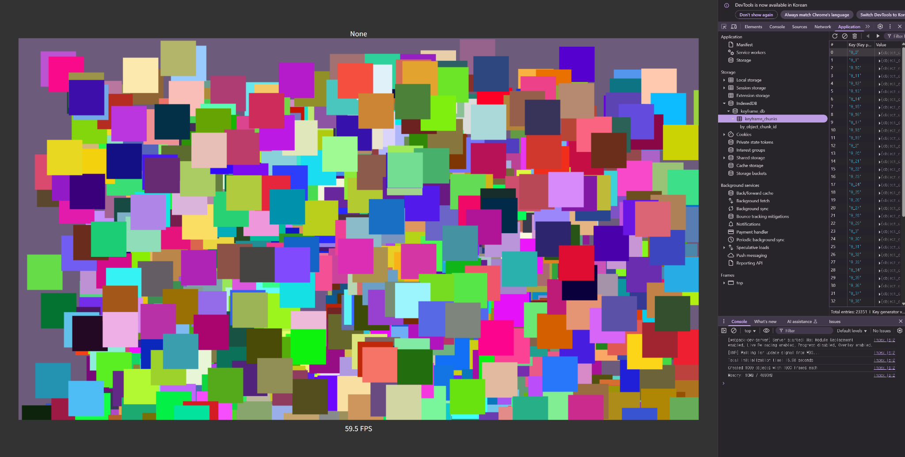

# Creator/Engine Engineer Assessment

## Getting Started

### ⚠️ Notice: IndexedDB Reset on Reload

> **Important:**  
Every time the program is restarted or the page is refreshed, the IndexedDB (`keyframe_db`) is **automatically cleared and reinitialized**.  
This ensures a consistent testing environment, but **all previously stored keyframe data will be lost** on each run.

If you wish to **preserve keyframe data across sessions** (e.g., for persistence testing), you can disable the database reset by commenting out the line below in the `KeyframeDatabase::new()` method:

```rust
// src/keyframe_database.rs

// This line deletes the existing IndexedDB each time the app runs.
// Comment it out to retain existing keyframe data across reloads:
factory.delete(db_name)?.await?;
```

### Prerequisites

* Rust toolchain with `wasm-pack`
* Node.js (v14+)
* A modern browser with IndexedDB support

### Installation

```bash
# Clone repository
git clone https://github.com/skxohn/rust_2d_engine
cd rust_2d_engine

# Install dependencies
npm install
```

### Running the Demo

```bash
npm run serve
```

Navigate to http://localhost:8081

### Usage

```javascript
// Import the WASM module
import('./pkg')
  .then(async wasm => {
    ...
    const totalObjects = 100;       // Number of square instances to generate
    const size         = 100;         // Size of each square (pixels)
    const keyframesPer = 1_000_000;   // Number of keyframes per square
    ...
}
```


## Assessment Requirements

| Requirement | Status | Implementation Details|
| ----------- | ------ | --------------------- |
| **1. Animate squares with 1,000,000 keyframes**                  | ✅      | Keyframes are generated randomly and stored in chunks. IndexedDB is used for persistent storage and LRU caching manages in-memory usage.                                             |
| **2. Pause animation on mouse drag**                             | ✅      | Mouse press events pause the animation loop and trigger hit testing. Animation resumes upon mouse release.                                                                           |
| **3. Report index of square under cursor**                       | ✅      | AABB (Axis-Aligned Bounding Box) hit testing is used to determine and display the index of the square directly under the pointer.                                                    |
| **4. Use WebAssembly (Rust) for core logic**                     | ✅      | All animation, keyframe management, interpolation, and hit testing are implemented in Rust and compiled to WebAssembly. JavaScript only handles canvas setup and user input routing. |
| **5. Render at least 1,000 square instances**                    | ✅      | The system supports rendering thousands of square instances efficiently. `totalObjects` can be adjusted to scale the instance count.                                                 |
| **6. Minimize latency between user input and feedback**          | ✅      | Pre-computed interpolated positions are cached to avoid redundant calculations during hit testing, resulting in low-latency response.                                                |
| **7. Efficient energy usage (minimize unnecessary computation)** | ✅      | Task queue separates data fetching (every 20ms) from the update/render loop (60fps). Redundant updates are avoided.                                                                  |
| **8. Clear documentation of design and process**                 | ✅      | This README outlines architecture, technical challenges, key decisions, and performance solutions. Relevant code snippets and explanations are included.                             |
---


## Features

* **1,000,000 Keyframes** generated randomly and stored in chunks.
* **Dynamic Square Instances** with random colors and per-square time offsets.
* **Linear Interpolation** between keyframes for smooth motion.
* **Pause-on-Drag** interaction that reports the index of the square under the cursor in real time.
* **Chunked IndexedDB Storage** for scalable keyframe management.
* **Efficient Memory Usage** through LRU (Least Recently Used) caching and chunked loading


## Screenshot



* `Center Canvas`: Displays thousands of animated square objects, each with a random color and offset into a shared keyframe animation.

* `Top Center ("None")`: This label shows the ID of the square currently under the mouse cursor during click-and-drag interactions. If no square is under the cursor, it displays "None".

* `Bottom Center ("59.5 FPS")`: Displays the current rendering frame rate, updated in real time.

* `Right Panel (DevTools)`: Shows IndexedDB storage under the keyframe_db > keyframe_chunks object store, where keyframe data is persisted in chunks per object.

* `Console Output`:

  * Logs the total initialization time after loading all objects and keyframes.

  * Shows how many square objects were created and how many keyframes each contains.

  * Displays the memory usage of the browser at runtime, allowing for quick verification of memory efficiency.


## Technical Architecture

### Technology Stack

* Frontend: HTML5, CSS3, JavaScript/TypeScript
* Animation & Computation: Rust, WebAssembly
* Storage: IndexedDB
* Build Tools: wasm-pack, webpack
* Development Environment: Node.js

### Project Structure

```plaintext
rust_2d_engine
├── src/
│   ├── animation_frame.rs
│   ├── engine.rs
│   ├── input.rs
│   ├── keyframe_database.rs
│   ├── keyframe_store.rs
│   ├── keyframe.rs
│   ├── lib.rs
│   ├── math.rs
│   └── squre_object.rs
├── Cargo.toml
├── index.html
├── index.js
├── package.json
├── README.md
└── webpack.config.js
```

## Technical Challenges and Solutions

### Challenge 1: Handling One Million Keyframes
**Problem**: Managing memory usage with such a large dataset.

**Solution**: Implemented chunked storage with IndexedDB and LRU caching.

* Initially implemented using a monolithic `Vec<Keyframe>`, which caused memory usage to spike as the number of objects increased.
* Improved by using IndexedDB to store keyframes and dynamically loading them in chunks as needed for playback.
* Implemented LRU (Least Recently Used) caching to delete the oldest chunks and dynamically load keyframe chunks required for playback.
* Created `save_chunks()` and `load_chunk()` functions in keyframe_database for IndexedDB storage and retrieval.
* Managed KeyframeChunks with LruCache in keyframe_store to optimize memory usage.
* Successfully prevented memory overflow issues, resulting in a stable system regardless of animation length.

```rust
// Key data structures for memory-efficient keyframe management
pub struct Keyframe {
    time: f32,
    x: f32,
    y: f32,
}

pub struct KeyframeChunk {
    object_chunk_id: String,
    start_time: f32,
    end_time: f32,
    keyframes: Vec<Keyframe>,
}

pub struct KeyframeStore {
    object_id: String,
    chunk_size: f32,
    total_duration: f64,
    loaded_chunks: Arc<RwLock<LruCache<u32, KeyframeChunk>>>,
    keyframe_db: Arc<KeyframeDatabase>,
}
```

### Challenge 2: Efficient Hit Testing
**Problem**: Determining which squares are under the cursor quickly.

**Solution**: Implemented using AABB (Axis-Aligned Bounding Box) structure.

* Initially implemented using simple loop optimization approaches.
* While performance testing showed no significant issues, the code was refactored to use AABB structures for better readability and maintainability.
* This approach resulted in clearer and more efficient hit testing logic that's easier to extend.

```rust
pub struct AABB {
    min_x: f64,
    min_y: f64,
    max_x: f64,
    max_y: f64,
}

impl AABB {
    pub fn new(min_x: f64, min_y: f64, max_x: f64, max_y: f64) -> Self {
        Self {
            min_x: min_x,
            min_y: min_y,
            max_x: max_x,
            max_y: max_y,
        }
    }
    
    pub fn contains_point(&self, x: f64, y: f64) -> bool {
        x >= self.min_x && x <= self.max_x && y >= self.min_y && y <= self.max_y
    }

    pub fn intersects(&self, other: &AABB) -> bool {
        !(self.max_x < other.min_x
          || self.min_x > other.max_x
          || self.max_y < other.min_y
          || self.min_y > other.max_y)
    }
}

pub fn hit_indices(&self, x: f64, y: f64) -> Vec<u32> {
    let objs = self.objects.borrow();
    
    objs.iter()
        .filter_map(|obj| {
            let bbox = AABB::new(obj.current_x(), obj.current_y(), obj.get_size());
            
            if bbox.contains_point(x, y) {
                Some(obj.object_id())
            } else {
                None
            }
        })
        .collect()
}
```

### Challenge 3: Cross-Thread Communication
**Problem**: Coordinating data loading and animation rendering.

**Solution**: Created a task queue system with separated concerns and message passing.

* Initial implementation handled keyframe fetching, updating, interpolation, and rendering all within the `window.request_animation_frame()` callback function.
* This caused issues including panics when asynchronously fetching keyframes.
* Improved by separating fetch() and update()+render() into distinct tasks processed through a task queue.
* The fetch() function (loading keyframes in chunks) is called every 20ms, while update() and render() run at 60fps through `window.request_animation_frame()`.
* While it would be possible to further separate update() and render(), the current implementation works well enough to maintain as is.

```rust
pub async fn run(self) -> Result<(), JsValue> {
    let engine = Rc::new(RefCell::new(self));
    let task_queue = engine.borrow().task_queue.clone();

    // Initial data fetch
    {
        let engine_clone = engine.clone();
        engine_clone.borrow_mut().fetch_data().await?;
    }

    // Set up periodic data fetching task (every 20ms)
    {
        let task_queue = task_queue.clone();
        let closure = Closure::wrap(Box::new(move || {
            task_queue.borrow_mut().push_back(EngineTask::FetchData);
        }) as Box<dyn FnMut()>);
        window().unwrap()
            .set_interval_with_callback_and_timeout_and_arguments_0(
                closure.as_ref().unchecked_ref(),
                20,
            )
            .unwrap();
        closure.forget();
    }

    // Setup animation frame loop for update and render
    {
        let engine_clone = engine.clone();
        let task_queue = task_queue.clone();
        let window = engine.borrow().window.clone();

        let f: Rc<RefCell<dyn FnMut() -> Result<(), JsValue>>> =
            Rc::new(RefCell::new(move || {
                if let Ok(mut eng) = engine_clone.try_borrow_mut() {
                    let now = eng.window.performance().unwrap().now();
                    let delta = now - eng.last_frame_time;
                    eng.last_frame_time = now;
                    task_queue.borrow_mut().push_back(EngineTask::UpdateAndRender(delta));
                }
                Ok(())
            }));

        animation_frame::request_recursive(window, f)?;
    }

    // Start the task processing loop
    Self::start_task_loop(engine);

    Ok(())
}
```

### Challenge 4: Performance Optimization
**Problem**: Duplicate calculations occurred between keyframe interpolation, rendering, and hit testing. Additionally, rendering all objects regardless of visibility caused unnecessary workload.

**Solution**:
  1. Calculation Caching for rendering and hit testing.

  2. AABB-Based Viewport Culling to skip off-screen objects during rendering.

### 1. Interpolation Caching
* Initially, each function independently performed interpolation calculations.
* Time-based interpolation especially required significant computational resources.
* Improved by performing coordinate calculations needed for both rendering and hit testing only once during the update() phase and caching the results.
* By caching calculated values, we prevented redundant calculations and significantly improved performance.

```rust
pub fn interpolate(&self, time: f32) -> Vector2 {
    // ... (interpolation logic)
}
```

```rust
pub fn update(&mut self, delta_time: f64) -> Result<(), JsValue> {
    self.current_time = (self.current_time + delta_time) % self.total_duration;
    if let Some(pos) = self.keyframe_store.get_interpolated_position(self.current_time) {
        self.cached_x = pos.x;
        self.cached_y = pos.y;
    }
    Ok(())
}
```

### 2. AABB Viewport Culling
* To avoid rendering objects not currently visible on the screen, an AABB (Axis-Aligned Bounding Box) intersection test is used.
* Only squares that intersect with the current viewport are passed to the render pipeline.
* This significantly reduces the rendering overhead, especially when thousands of square objects are involved.

```rust
fn render(&mut self) -> Result<(), JsValue> {
    //...
    let objs = self.objects.get_mut();
    for obj in objs.iter_mut() {
        let bbox = AABB::new(
            obj.current_x(), 
            obj.current_y(), 
            obj.current_x() + obj.get_size(),
            obj.current_y() + obj.get_size(),
        );

        // Skip rendering if object is outside the current viewport
        if !bbox.intersects(&self.viewport) {
            continue;
        }

        obj.render(&self.context)?;
    }
    //...
}

```
## Test Environment

All performance measurements were conducted in the following environment:

### Hardware

* **Processor**: 13th Gen Intel(R) Core(TM) i7-1360P 2.20 GHz
* **RAM**: 64.0 GB

#### Software

* **Operating System**: Windows 11 Home
* **Browser**: Chrome 136.0.7103.114 (64-bit)

Performance results may vary on systems with different hardware specifications.
## Performance Metrics
The following table summarizes initialization time, memory usage, and rendering performance across varying numbers of square objects (each with 1,000,000 keyframes):

| Number of Objects | Total Initialization Time             | Memory Usage (Heap) | Frame Rate        |
| ----------------- | ------------------------------------- | ------------------- | ----------------- |
| 1                 | 5.54 seconds                          | 28MB / 4096MB       | \~60 FPS          |
| 10                | 80.94 seconds (1 min 20.94 sec)       | 34MB / 4096MB       | \~60 FPS          |
| 100               | 831.52 seconds (13 min 51.52 sec)     | 33MB / 4096MB       | \~60 FPS          |
| 1,000             | 10,031.47 seconds (167 min 11.47 sec) | 45MB / 4096MB       | \~60 FPS          |

* **Memory usage** remains stable and low due to chunked keyframe loading and LRU caching.

* **Initialization time** scales linearly with object count, primarily due to database writes and preprocessing.

* **Rendering performance** is consistently stable at ~60 FPS regardless of object count.
